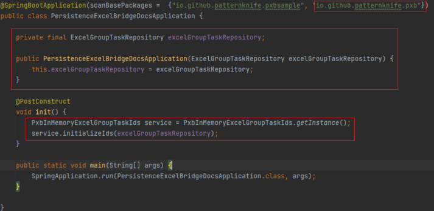
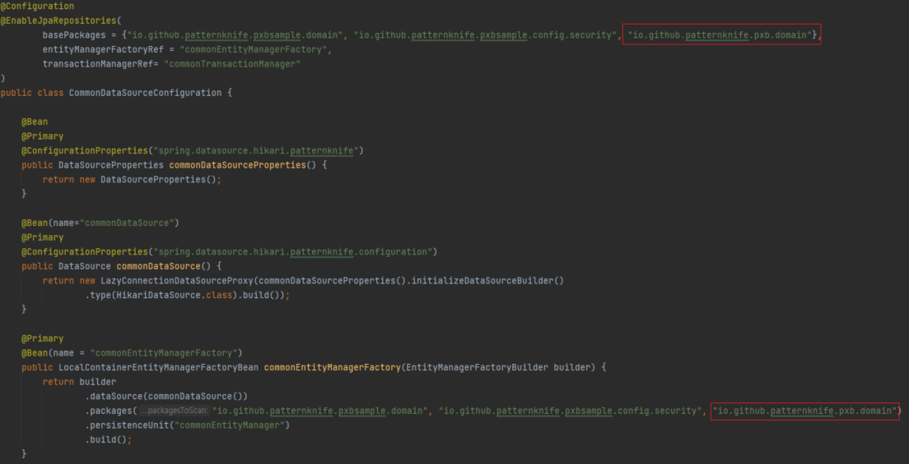

# Persistence-Excel-Bridge

> Memory-efficient mass data transfer between Excel and database using Apache POI, Spring Event, Async Threads
- Create an Excel file with millions of rows of data from the database with minimal impact on heap memory

## Table of Contents
- [Features](#Features)
- [Requirements](#Requirements)
- [Quick Settings](#Quick-Settings)
- [Quick Guide on APIs (TO DO)](#Quick-Guide-on-APIs)
- [Structure (TO DO)](#Structure)
---

## Features

- In the case of data transfer from the database to Excel, ``Persistence-Excel-Bridge`` fetches data using pagination.
- Using Spring Events, it calculates the total data size and then creates a job queue.
  - It sets the Max ID value to ignore any data generated after this point to avoid disrupting the pagination process.
- It utilizes idle threads to perform asynchronous chunked data transfer between Excel and the database.

## Requirements

| Category          | Dependencies                                     |
|-------------------|--------------------------------------------------|
| Backend-Language  | Java 17                                          |
| Backend-Framework | Spring-Boot 3.1.2                                |
| Libraries         | JPA & QueryDSL are necessary... More in pom.xml. |

## Quick Settings

### Central Repository OR Build source codes

1) Central Repository
````xml
<dependency>
    <groupId>io.github.patternknife.pxb</groupId>
    <artifactId>persistence-excel-bridge</artifactId>
    <version>0.0.1</version>
</dependency>
````

2) Build source codes
- Build the 'persistence-excel-bridge' (library) by running at the project root (./)
  - WIN : ``./mvnw clean install`` or ``.\win-mvn-build.bat``
  - Linux : After installing the Maven, ``mvn clean install``
- Build the 'persistence-excel-bridge-docs' (Sample project for testing the library) by running at './docs'
  - Same as above.

### DB Schema
- Running ``./docs/mysql/schema.sql`` covers both **persistence-excel-bridge** and **persistence-excel-bridge-docs** 
- Running ``./src/main/java/com/patternknife/pxb/domain/exceldbreadtask/schema/excel-db-read-task-schema.sql`` and ``./src/main/java/com/patternknife/pxb/domain/exceldbwritetask/schema/excel-db-write-task-schema.sql`` and ``./src/main/java/com/patternknife/pxb/domain/excelgrouptask/schema/excel-group-task-schema.sql`` cover only **persistence-excel-bridge**, which means the library requires only the three tables.

### Properties
- Add ``io.github.patternknife.pxb.dir.root.excel-group-tasks=files/private/excel-group-tasks`` to your App's ``application.properties``.

### Things to Set in Your App
- Let me explain this with the sample project (persistence-excel-bridge-docs).
- Set the highlighted sources (or equivalent items applicable to your situation) in your App.
- ```!IMPORTANT``` : ``com.patternknife`` has been changed to ``io.github.patternknife``. I will change the screenshots below soon.

#### 1) SpringBootApplication : ``./docs/src/main/java/com/patternknife/pxbsample/PersistenceExcelBridgeDocsApplication.java``

- 

#### 2) EnableJpaRepositories : ``./docs/src/main/java/com/patternknife/pxbsample/config/database/CommonDataSourceConfiguration.java``

- 

- ``com.patternknife.pms.domain`` should be recognized in your App.

#### 3) Spring Event & Thread Pools

- 

- Just copy & paste the folder, and you can change some values if you'd like such as the thread pool size.

#### 4) Implementations of the Library

- 

- 4-1) ``api`` : Just copy and paste the folder, then customize the settings such as the REST API addresses and payload.
- 4-2) ``cache`` : Write the class by referring to the sample.
- 4-3) ``factoyr`` : Write the class by referring to the sample.
- 4-4) ``processor`` : Write the class by referring to the sample.

#### 5) Logging

- Add the following to your ``logback-spring.xml``

```xml
<?xml version="1.0" encoding="UTF-8"?>
<configuration scan="true" scanPeriod="30 seconds" debug="true">

  <!-- Set common variables here -->
  <property name="LOGS_ABSOLUTE_PATH" value="logs"/>
  
  
  <appender name="PxbAsyncLogConfig"
            class="ch.qos.logback.core.rolling.RollingFileAppender">
      <file>${LOGS_ABSOLUTE_PATH}/pxb-async-log-config/current.log</file>
      <encoder
              class="ch.qos.logback.classic.encoder.PatternLayoutEncoder">
          <!--<pattern>%d{yyyy-MM-dd HH:mm:ss} [%thread] %-5level %logger{36} - %msg%n</pattern>-->
          <Pattern>%d %p %C{1} [%t] %m%n</Pattern>
      </encoder>

      <rollingPolicy
              class="ch.qos.logback.core.rolling.TimeBasedRollingPolicy">
          <!-- Create a log file every minute and manage it in 10MB units. -->
          <fileNamePattern>${LOGS_ABSOLUTE_PATH}/pxb-async-log-config/%d{yyyy-MM}/past-%d{yyyy-MM-dd_HH}.%i.log
          </fileNamePattern>
          <maxHistory>50</maxHistory>
          <timeBasedFileNamingAndTriggeringPolicy
                  class="ch.qos.logback.core.rolling.SizeAndTimeBasedFNATP">
              <maxFileSize>10MB</maxFileSize>
          </timeBasedFileNamingAndTriggeringPolicy>
      </rollingPolicy>
  </appender>


  <logger name="io.github.patternknife.pxb.config.logger.module" level="TRACE">
  <appender-ref ref="PxbAsyncLogConfig" />
  <!--<appender-ref ref="Console" />-->
  </logger>
  
  
  <root level="info">
    <appender-ref ref="Console"/>
  </root>


</configuration>

```
